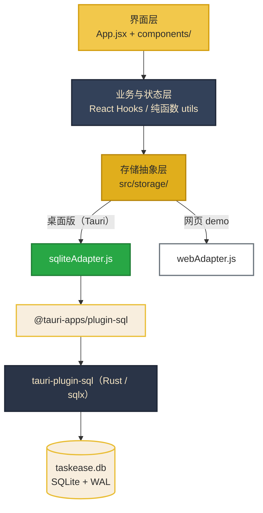
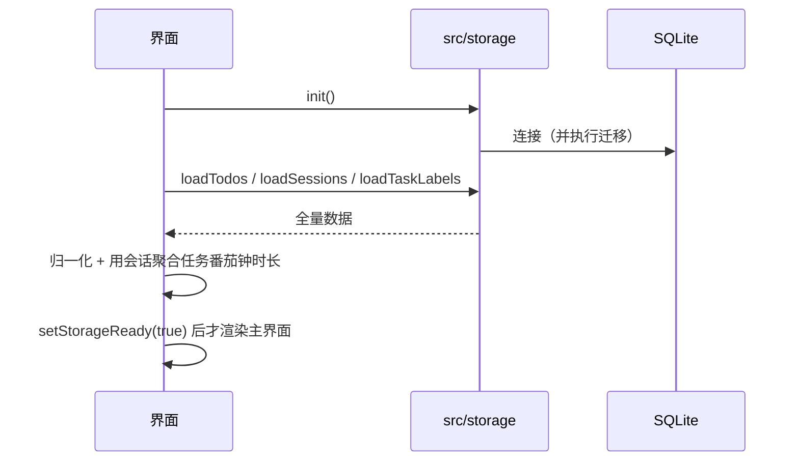

# TaskEase 架构说明

本文档描述当前（桌面版）的架构、分层、数据流与关键技术决策。

> 历史背景：项目最初是 React + Vite + Supabase 的网页应用（含账号体系与云同步）。
> 现在 Supabase 已被完全移除，改为**单机单用户 + 本地 SQLite**。

---

## 一、技术栈

| 层 | 技术 |
|---|---|
| 桌面外壳 | **Tauri 2**（Rust） |
| 界面 | React 18 + Vite 5 |
| 样式 | Bootstrap 5 + Bootstrap Icons + 自定义 CSS |
| 本地数据 | **SQLite**（通过 `@tauri-apps/plugin-sql`） |
| 字体 | Manrope（`@fontsource` 本地打包）+ 系统中文字体栈 |
| 测试 | Vitest（单元 + 真实 SQLite 引擎集成测试） |

**没有**：服务端、账号系统、云同步、网络请求、外部 CDN。

---

## 二、整体分层



**关键约束**：界面层与业务层**不允许**直接接触 `localStorage`、`Database` 或任何 Tauri API。
所有持久化都必须经过 `src/storage/`，这是「一套代码两个产物」的前提。

---

## 三、存储抽象层

### 3.1 接口约定

`src/storage/index.js` 按运行环境（探测 `window.__TAURI_INTERNALS__`）选择实现，对业务层暴露同一组 async 接口：

| 方法 | 作用 |
|---|---|
| `init()` | 初始化；桌面端会触发数据库连接与迁移 |
| `loadTodos()` / `loadSessions()` / `loadTaskLabels()` | 读取全量数据 |
| `saveTodos(list)` / `saveSessions(list)` | 全量 upsert |
| `deleteSession(id)` | 精确删除单条番茄钟会话 |
| `saveTaskLabels(list)` | 覆盖标签库 |
| `exportAll()` | 取出全部数据（备份用） |
| `replaceAll(payload)` | 整体覆盖（恢复备份用） |

### 3.2 两种实现

| | `sqliteAdapter.js` | `webAdapter.js` |
|---|---|---|
| 用于 | 桌面版 | 网页 demo |
| 底层 | SQLite | localStorage |
| 原子性 | ✅ 事务保证 | ❌ 整集合重写 |
| 用途 | 真实使用 | 展示 / 演示 |

### 3.3 读写语义的重要差异

- **任务采用软删除**（`status = 'deleted'`），因此写入只做 **upsert 不物理删除**，避免误删历史记录
- **番茄钟会话采用物理删除**，因此额外提供 `deleteSession(id)` 做精确删除

### 3.4 SQL 构造

`sqlBuilders.js` 是**纯函数**模块，负责把对象数组转成多行 `INSERT ... ON CONFLICT(id) DO UPDATE`：

- 按 `TODO_CHUNK = 50` / `SESSION_CHUNK = 100` 分片，避免触碰 SQLite 变量上限
- 空值归一化（SQLite 不接受 `undefined`；数字列保证落库是数字）
- **最关键的不变式**：SQL 里 `?` 占位符数量必须严格等于绑定参数个数

该不变式由 `sqlBuilders.test.js` 与 `sqliteSchema.integration.test.js` 双重守护——后者用 Node 内置的真实 SQLite 引擎加载**真实迁移脚本**建表后执行这些 SQL。

---

## 四、数据流

### 4.1 启动



**为什么要等加载完成才渲染**：桌面端读取是异步的。若先渲染空界面，用户可能在加载返回前就添加任务，随后被加载结果覆盖。用 `storageReady` 门控可以从根本上消除这个竞态，而不是靠「窗口期很短」来赌。

### 4.2 修改数据

```
用户操作 → 更新内存状态（立即反馈）→ 异步写持久层（不阻塞界面）
```

写入失败通过 `storageErrorHandler` 统一上报到 Toast，不会静默丢数据。

### 4.3 备份

导出：`storage.exportAll()` → 组装为带 `format: "taskease-backup"` 的 JSON → 系统「另存为」对话框 → Rust 命令写入文件。

导入：系统「打开」对话框 → Rust 命令读文件 → `parseBackup()` **先校验格式**（不符则中止，不碰现有数据）→ `storage.replaceAll()` → 重新加载内存状态。

---

## 五、数据库

### 5.1 位置

```
%APPDATA%\com.baiweichihu.taskease\taskease.db
```

前端使用**相对连接串** `sqlite:taskease.db`，由 Tauri 按 Windows 规范解析。应用不自行改写数据目录，保持与系统约定一致。

### 5.2 表结构

| 表 | 说明 |
|---|---|
| `todos` | 任务。软删除，含优先级 / 标签 / 重复规则 / 重复截止日期 / 进度 / 番茄钟累计时长 |
| `pomodoro_sessions` | 番茄钟会话。**真源**——任务的累计时长由会话聚合得出，而非单独维护 |
| `task_labels` | 标签库（用户手动维护，与任务上的 `label` 字段互补） |
| `app_meta` | 预留元信息 |
| `_sqlx_migrations` | 迁移版本记录（由 sqlx 维护） |

索引：`todos(status)`、`todos(ddl)`、`pomodoro_sessions(task_id)`、`pomodoro_sessions(start_time)`。

### 5.3 迁移机制

迁移脚本放在 `src-tauri/migrations/`，在 `src-tauri/src/lib.rs` 中以版本号注册：

```rust
let migrations = vec![Migration {
    version: 1,
    description: "create_initial_tables",
    sql: include_str!("../migrations/001_init.sql"),
    kind: MigrationKind::Up,
}];
```

**今后修改表结构的正确做法**：新增 `002_xxx.sql` 并追加一个 `Migration` 条目，**不要**改动已发布的迁移脚本。

---

## 六、Rust 侧

`src-tauri/src/lib.rs` 注册的插件与命令：

| 名称 | 作用 |
|---|---|
| `tauri-plugin-single-instance` | **必须第一个注册**。重复启动时不开新窗口，而是把已有窗口唤到前台——避免两个窗口同时写同一个数据库 |
| `tauri-plugin-sql` | SQLite 访问与迁移 |
| `tauri-plugin-dialog` | 备份导出/导入用的原生文件对话框 |
| `tauri-plugin-log` | 仅 debug 构建启用 |
| `write_backup_file` / `read_backup_file` | 备份文件读写。路径来自系统对话框，因此无需申请文件系统权限 |

窗口尺寸、标题、居中在 `tauri.conf.json` 中声明，保持配置驱动。

### 权限清单

`capabilities/default.json` 只授予必要权限：

```
core:default
sql:default / sql:allow-execute / sql:allow-select / sql:allow-load / sql:allow-close
dialog:allow-save / dialog:allow-open
```

---

## 七、主题系统

主题被有意简化为一维：

- **配色**：只有「米黄」一套（`getThemeColors(tone)` 只按明暗返回）
- **色调**：`light` / `dark` / `system` 三选，`system` 跟随 `prefers-color-scheme` 并监听其变化

`resolvedTheme` 是最终生效的明暗值，通过 `document.documentElement[data-bs-theme]` 驱动 Bootstrap 5 的深色模式。

**界面偏好（主题 / 语言 / 时间制式）存在 localStorage**，而不是 SQLite：它们体量极小、丢失成本极低，但需要**同步读取**以避免首屏主题闪烁。任务与番茄钟等关键数据一律进 SQLite。

---

## 八、国际化

文案集中在 `src/App.jsx` 顶部的 `TEXT` 对象，按 `zh-CN` / `en` 两个分区组织。

`scripts/check-i18n.mjs` 做双向一致性检查：

1. **被使用但未定义**（会导致界面显示 `undefined`）—— 出现在此列表即为 bug
2. **已定义但未被引用** —— 冗余文案，可清理

两个分区的 key 集合必须完全一致，脚本会报告差异。

---

## 九、离线优先

- **字体**：Manrope 通过 `@fontsource/manrope` 打进产物；中文使用系统字体栈（微软雅黑 / 苹方等），**不打包数 MB 的 CJK 字体**
- **图标**：Bootstrap Icons 随构建产物打包
- **无外链**：`index.html` 中不存在任何外部 `<link>`

因此桌面版首次启动即可完全离线渲染。

---

## 十、构建目标切换

`vite.config.js` 通过 `TAURI_ENV_PLATFORM`（Tauri 在 `beforeBuildCommand` 中注入）识别桌面构建，并切换 `base`：

| 目标 | base | 原因 |
|---|---|---|
| 桌面版 | `./` | 通过 Tauri 自定义协议加载，必须用相对路径 |
| 网页版 | `/<repo>/` | GitHub Pages 子路径部署 |

业务代码完全不受影响。

---

## 十一、测试策略

| 文件 | 覆盖内容 |
|---|---|
| `utils/recurrence.test.js` | 重复规则与下一次日期计算 |
| `tests/planWork.test.js` | 自动规划算法 |
| `tests/pomodoroProgress.test.js` | 番茄钟进度累加 |
| `tests/pomodoroSessions.test.js` | 会话去重与合并 |
| `storage/sqlBuilders.test.js` | SQL 占位符与参数严格对齐、分片、空值归一化 |
| `storage/sqliteSchema.integration.test.js` | **真实 SQLite 引擎** + **真实迁移脚本**：建表、批量写入、幂等更新、参数化绑定防注入、会话删除 |
| `storage/backup.test.js` | 备份解析；**格式非法时绝不写入数据** |

---

## 十二、关键设计决策

| 决策 | 理由 |
|---|---|
| 选 Tauri 而非 Electron | 安装包 2.4 MB vs 约 100 MB；内存占用更低 |
| 用 SQLite 而非 JSON 文件 | 事务原子性；会话记录会持续增长，SQL 聚合更自然 |
| 不用 Python | SQLite 是嵌入式 C 库，并非 Python 专属；引入 Python 需额外打包运行时并增加 IPC 层，与轻量化目标相悖 |
| 数据目录沿用系统约定 | 不自作主张，符合 Windows 应用惯例，便于用户与备份工具预期 |
| 存储层抽象 | 一套业务代码产出两个产物；将来加移动端只需新增适配器 |
| 偏好留在 localStorage | 需同步读取以避免首屏闪烁；丢失成本极低 |
| 任务软删除 | 保留历史，避免误删；也让「只 upsert 不删」的写入策略成立 |
